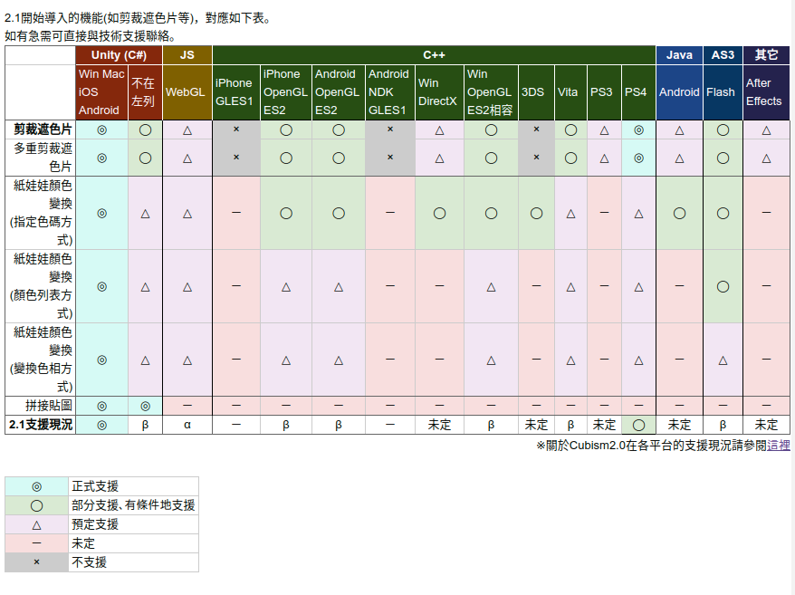

目前的可参考的资料有:
- [live2D官网](https://www.live2d.com/)
- [live2D中文文档](https://www.live2d.com/usermanual/cubism2_cn/sdk_tutorial.html)
- [相关项目一：faceMoji的github地址](https://github.com/huihut/Facemoji/)
	- [faceMoji1的blog](https://blog.huihut.com/2018/02/08/Facemoji1/)
- [unity+live2D相关教程](https://www.live2d.com/usermanual/cubism2_cn/lets-do-it/my-first-lapp.html)
- live2D目前的支持情况
