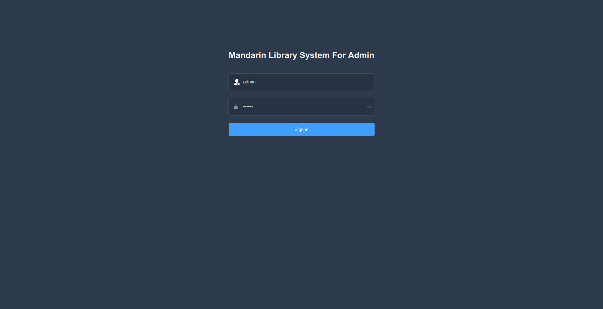
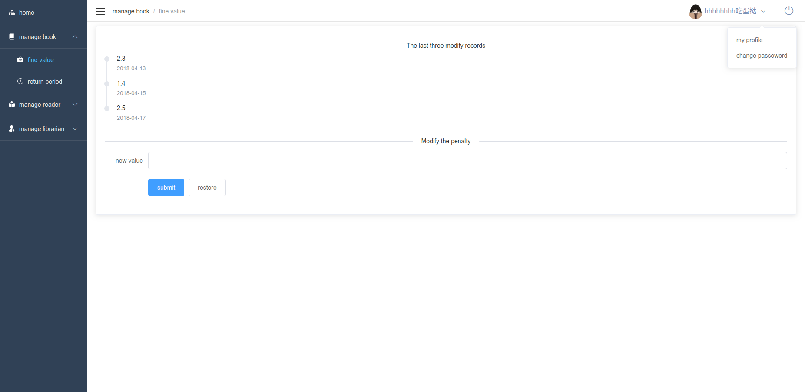
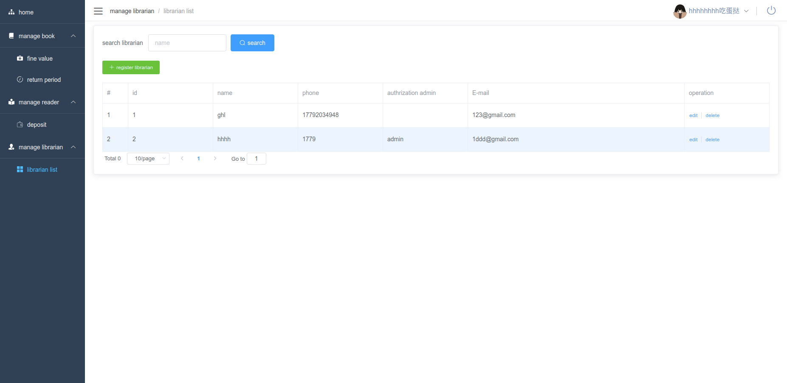

# admin module for mandarin  library

###### it's a simple web project use vue-cli and spring booot
> front-end :[Huaiyu Gong](https://github.com/JialuGong)<br>
> back-end :[floatinjianghu](https://github.com/floatinjianghu)

### functions
- [x] login in/out
- [x] register new librarian
- [x] edit/delete librarian
- [x] set/modify fine value
- [x] set/modify book return value
- [x] set/modify reader deposit value
- [x] obtian librarian password
- [ ] change admin password

___
- release 2
> origin

- [x] searching libarain account
- [x] setting book fine value

 > now

- [x] searching librarian account
- [x] setting book information
- [x] obtaining librarian password
- [x] setting readers's  deposit

- ralease 3
> oringin

- [x] obtain librarian password
- [x] setting reader's deposit
- [ ] change admin password

 > now

- [ ]change password 
___

### How to run
###### addtional remarks
front-end port:8001
back-end portt:8080
（请注意这两个端口有无被占用）
###### front-end
1. install node(推荐使用nvm)
	- windows 安装[nvm](https://github.com/coreybutler/nvm-windows/releases)
	- 安装node(v12.10.0)
	```shell
    nvm install 12.10.0
    ```
    - 使用node(v12.10.0)
    ```shell
    nvm use 12.10.0
    ```
2. run the front-end project
	进入front-end项目根目录：/front-end/mandarin_admin
    ```shell
    npm install
    npm run server
    ```

- ps：若npm install较慢，请切换到淘宝源
- pss：对于nvm出现无法安装的问题：请在nvm的setting.txt中添加淘宝源


###### back-end(本模块只涉及到admin后端，数据库与已有数据库不一致)

1. 环境准备:
- mysql 5.6/5.7  
- 安装idea(可学校邮箱认证)  
- tomcat 8.5  
- jdk 1.8  

2.项目运行:  
- 数据库
  - 数据库命名:mandarin  
  - 用户名:root  
  - 密码:root  
  （或者按照自己电脑本身的mysql用户名密码，但要在application.properties里面修改配置文件)  
- 配置idea的tomcat，jdk  
- 导入项目后  
  - 点击idea最右边菜单栏中的maven，分别点击clean:clean→install:install→springboot:run
  - （或者:点击idea下方terminal依次输入以下命令行: 
```shell
mvn clean
```
```shell
mvn install
```
```shell
mvn spring-boot:run
```
完成上述步骤后，接口即可使用。


### the GUI
>login


>home


>fineValue



>mangeLirarian




### TODOS
- resolve error
	- token超时
	- 数据的双向绑定
- test